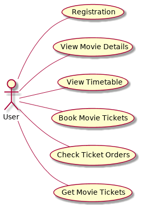

# Movie Example
一個完整Microservices範例

## Use Case

## Scenario
```gherkin
Feature: User Registraion
    Scenario Outline: User Registraion
        Given I am a unregister user
            And I provide a <name>
            And I provide a <phone>
        When I register the account
        Then I got my user id
            And I can check my name is <name>
            And I can check my phone number is <phone>

        Examples:
            | name  | phone       |
            | Ben   | 1234567890  |
            | Marry | 1234523590  |
```
```gherkin
Feature: Movie Detail
    Background:
        Given the following movies exist:
            | name        |
            | La La Land  |
            | Moonlight   |
            | Zootopia    |

    Scenario: View All Movie Detail
        Given I am a guest
        When I view all movies detail
        Then I get 3 movies detail

    Scenario Outline: View a Specific Movie Detail
        Given I am a guest
            And I provide a <movieName>
        When I view a specific movies detail
        Then The movie name should be exist

        Examples:
            | movieName   |
            | La La Land  |
            | Moonlight   |
            | Zootopia    |
```
```gherkin
Feature: Movie Timetable

    Background:
        Given the following show exist:
            | startTime  | theater | emptySeat | movie       |
            | 10:00      | 2       | 21        | La La Land  |
            | 10:10      | 3       | 12        | La La Land  |
            | 10:20      | 1       | 2         | Moonlight   |
            | 13:00      | 4       | 0         | Zootopia    |

    Scenario: View Movie Timetable
        Given I am a guest
        When I view timetable
        Then I get 4 show information

    Scenario Outline: View Show Detail
        Given I am a guest
            And I provide a <movie>
        When I view show detail
        Then The number of result should be <resultNumber>
            And <emptySeat> empty seat should be exist in one item
        
        Examples:
            | movie      | resultNumber | emptySeat   |
            | La La Land | 2            | 21          |
            | La La Land | 2            | 12          |
            | Moonlight  | 1            | 2           |
            | Zootopia   | 1            | 0           |
```
```gherkin
Feature: Ticket

    Scenario: Book tickets
        Given the following the user exist:
            | name  | phone       |
            | Ben   | 1234567890  |
            And the show exist:
                | startTime  | theater | emptySeat | movie       |
                | 10:00      | 2       | 21        | La La Land  |
        When The user book a La La Land ticket
        Then Successful book the ticket

    Scenario: Pick up tickets
        Given Ben is a user
            And Ben has a order which is not picked up
        When The Ben pick the ticket
        Then Successful pick up the ticket
```
## 架構圖
Movie Example的系統架構圖，Eureka是擔任服務發現的角色，Zuul是擔任API Gateway的角色，系統主要有4個服務，分別是User、Movie、Order、Theather，每一個服務都有獨立的資料庫。


## Sequence Diagram


## Services

總共有4個微服務，分別為User、Movie、Theater、Order。

### User Service
- POST /user/registration 使用者註冊
- GET /user/{id} 抓取使用者資訊

#### User Modal
```java
public class User {
    String id;
    String name;
    String phone;
}
```

### Movie Modal
- GET /movie/timetable 取得電影資訊
- GET /movie/{id} 取得該電影資訊
- GET /movie/?q={name} 取得該電影資訊
- POST /movie/ 新增電影

#### Movie Model
```java
public class Movie {
    String id;
    String title;
    String year;
    String rated;
    String runTime;
    String genre;
    String director;
    String actors;
    String plot;
}
```

### Theater Modal
- GET /theater/timetable 電影時刻表
- GET /theater/{theatherId} 電影廳資訊
- GET /theater/show/{showId} 電影廳該場次資訊
- POST /theater/book/{showId} 預約座位

#### Theater Model
```java
public class Theater {
    String id;
    int capacity;
}
```
#### Show Model
```java
public class Show {
    String id;
    String theaterId;
    String movieId;
    long start;
    long end;
    int emptySeat;
}
```

### Order Modal
- POST /book 訂票
- GET /tickets/user/{userId} 查看訂票
- POST /tickets/{orderId} 取票

#### Order Model
```java
public class Order {
    String id;
    String userId;
    String showId;
    long timestamp;
    boolean isPickUp;
    int ticket;
}
```

# All Repository
- services
    - movie-user
    - movie-movie
    - movie-theater
    - movie-order
- support
    - movie-zuul
    - movie-eureka
- test
    - movie-service-test
    - movie-uat
- deployment config
    - movie-deployment

# Tool
- test
    - pact broker
- CI
    - jenkins
- deployment
    - docker-compose
- analysis system
    - MCA
    - MGP

# Setup

## Environment
- Vagrant
- [vagrant-docker-compose](https://github.com/leighmcculloch/vagrant-docker-compose)
install by `vagrant plugin install vagrant-docker-compose`
- VirtualBox

## Pipline
The pipline need following env.
```
export MGP=localhost:10000
export PACT_URL=http://localhost:8880/      
export DB_HOST=localhost
```
### Unit Test
In each core servie project, there is a `unitTest.sh`

Run with `sh ./unitTest.sh`

When the test finish, the mca file will upload to mgp. The pact file will upload to pact broker.

### Build
Build jar file and build docker image.

## Pact Broker
1. To run the Pact Broker, run `docker-compose up -d` in tool folder.
2. Run `sh ./runAllTest.sh` in root folder to run all unit test in project and upload to pact broker.

The list of consumer and provider and their relationship


Visual the relationship between services


The contract between service

