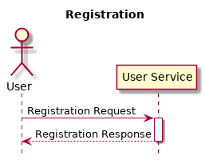

# Movie Example
一個完整Microservices範例

## Use Case


## Sequence Diagram



## Services

總共有4個微服務，分別為User、Movie、Theater、Order。

### User
- POST /user/registration 使用者註冊
- GET /user/{id} 抓取使用者資訊

#### User Table
```java
public class User{
    UUID id;
    String name;
    String phone;
    boolean isValid;
}
```

### Movie
- GET /movies 取得電影資訊
- GET /movie/{id} 取得該電影資訊

#### Movie Table
```java
public class Movie{
    UUID id;
    String title;
    int year;
    String rated;
    int runTime;
    String genre;
    String director;
    String actors;
    String plot;
}
```

### Theater
- GET /theater/timetable 電影時刻表
- GET /theater/{theatherId} 電影廳資訊
- GET /theater/{theatherId}/{showId} 電影廳該場次資訊

#### Theater Table
```java
public class Theater{
    int id;
    int capacity;
}
```
#### Show Table
```java
public class Show{
    UUID id;
    int theaterId;
    UUID movieId;
    long start;
    long end;
    int emptySeat;
}
```

### Order
- POST /order 訂票
- POST /tickets 取票

#### Order Table
```java
public class Order{
    UUID id;
    UUID userId;
    UUID showId;
    long timestamp;
    boolean isPickUp;
}
```